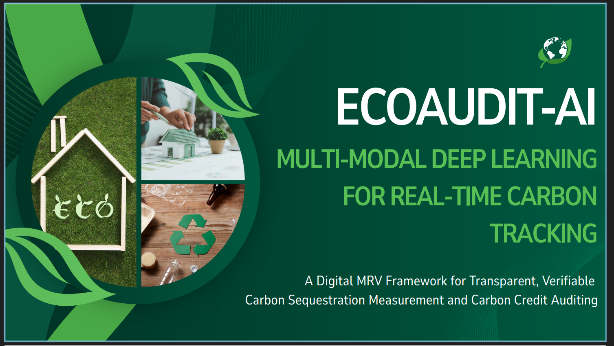
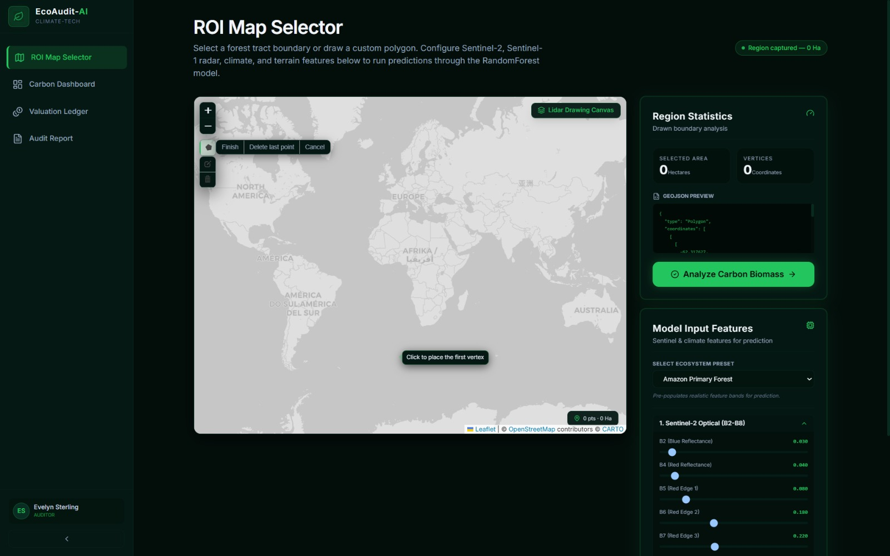
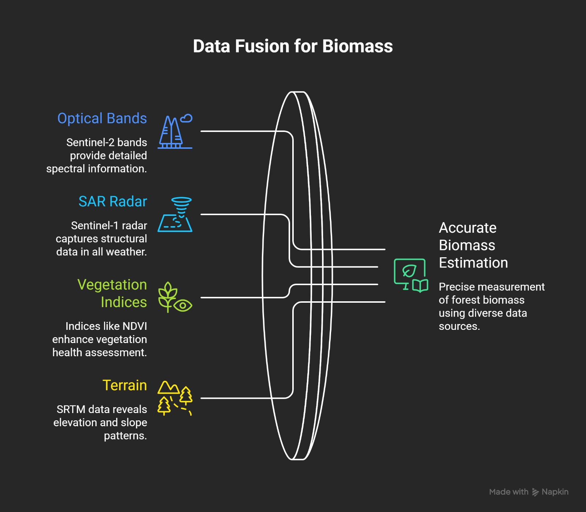

<p align="center">
  <a href="" rel="noopener">
 </a>
</p>

<h1 align="center">EcoAudit-AI 🌍🛰️</h1>

<div align="center">

  [](https://smartearth2026.smartearth-hackathon.org/) 
  []()
  []() 
  [](LICENSE.md)

</div>

---

<p align="center"> <b>A Digital MRV (Measurement, Reporting, and Verification) Framework</b> utilizing multi-modal deep learning and satellite data fusion to deliver transparent, verifiable carbon sequestration tracking.
    <br> 
</p>

## 📝 Table of Contents
- [Problem Statement](#problem-statement)
- [Idea / Solution](#idea--solution)
- [Core Features](#core-features)
- [System Architecture & Methodology](#system-architecture--methodology)
- [Technology Stack](#technology-stack)
- [Getting Started / Installation](#getting-started--installation)
- [Team ByteForce Branching Strategy](#team-byteforce-branching-strategy)
- [Future Scope](#future-scope)
- [Authors & Team](#authors--team)

---

## 🚨 Problem Statement 
Accurate quantification of forest biomass (AGB) and carbon stocks underpins the multi-billion-dollar voluntary carbon credit market. Yet, existing audit methods face critical technical barriers that enable **greenwashing**:

1. **Manual Field Inventories:** Logistically inefficient and impossible to scale to remote regions.
2. **Optical Data Limitations:** Standard satellites suffer from **Cloud Occlusion** (especially in rainforests) and **Canopy Signal Saturation** (dense forests produce identical reflectance to young woodlands).
3. **Hidden Carbon Ignored:** Existing tools only measure above-ground biomass, ignoring root systems and soil organic carbon.

---

## 💡 Idea / Solution 
**EcoAudit-AI** is a comprehensive dMRV platform designed to combat greenwashing.

By fusing **Sentinel-1 (Synthetic Aperture Radar)** and **Sentinel-2 (Optical)** satellite imagery via the **CIOPB Framework**, our system bypasses cloud and canopy saturation limits. We utilize a **PIO-optimized BiLSTM Deep Learning Model** to generate high-integrity forest biomass tracking, partitioning results into multiple ecological pools paired with a Monte Carlo uncertainty map.

<p align="center">
 
 <br>
 <em>The EcoAudit-AI interactive auditor dashboard rendering multi-pool carbon metrics.</em>
</p>

---

## 🚀 Core Features 
- 🗺️ **Point-and-Click ROI Selector:** An interactive Mapbox/Leaflet canvas allowing auditors to draw custom polygons over forested assets for instant evaluation.
- 🌳 **Multi-Pool Carbon Splitter:** Instantly partitions total biomass inference into three distinct ecological pools: *Aboveground Biomass*, *Belowground Roots*, and *Soil Organic Carbon*.
- 📊 **Temporal Timeline Scrubber:** Scrub between historical baselines and current dates to compute real-time carbon sequestration trends.
- 📄 **Automated PDF Audit Reports:** Pixel-level maps, pool breakdowns, and confidence metrics compiled into an immutable, downloadable audit trail to prevent double-counting.
- 🎯 **0-40% Uncertainty Propagation:** Runs Monte Carlo simulations to deliver confidence maps, proving to auditors exactly where predictions are stable.

---

## 🏗️ System Architecture & Methodology 
Our backend data ingestion and machine learning pipeline (CIOPB) transitions seamlessly from raw geospatial extraction to automated validation reports:

## 🏗️ System Architecture & Methodology 
Our backend data ingestion and machine learning pipeline transitions seamlessly from raw multi-modal geospatial extraction to predictive analytics and automated verification reports:

<p align="center">
  
  <br>
  <em>Figure: Detailed pipeline illustrating multi-modal satellite data ingestion, Random Forest regression, and dMRV reporting layers.</em>
</p>

1. **Multi-Modal Data Fusion & Engineering:** Collects structural radar geometry (**Sentinel-1 Radar**) and multi-spectral bands (**Sentinel-2 Optical**), filtering out cloud occlusion while calculating key vegetation indices and terrain slopes over selected Regions of Interest (ROI).

2. **Predictive Modeling Engine:** Utilizes an optimized **Random Forest Regression Model** trained against high-integrity **GEDI Spaceborne LiDAR** ground-truth targets to model complex, non-linear environmental relationships.

3. **Feature Valuation & Assessment:** Leverages the **Gini Index (MDI)** for strict feature importance ranking, ensuring transparent model explainability before calculating localized biomass, assessing total accuracy, and compiling structural validation reports.

---

## 💻 Technology Stack 
- **Frontend:** Next.js / React, Tailwind CSS, Folium/Mapbox API
- **Backend:** Python 3.11, FastAPI, Uvicorn
- **AI / ML Engine:** PyTorch, Scikit-Learn, Google Earth Engine (GEE) Python API
- **Database (MVP):** In-Memory Dictionary / PostgreSQL (PostGIS)
- **Deployment:** Vercel (Frontend), Render (Backend)

---

## 🏁 Getting Started / Installation

### Prerequisites
- Python 3.11+
- Node.js (v18+)
- Google Earth Engine Service Account credentials (`credentials.json`)

### Installation & Local Setup

**1. Clone the repository:**
```bash
git clone [https://github.com/Adityaraj-Gupta-JI/EcoAudit-AI.git](https://github.com/Adityaraj-Gupta-JI/EcoAudit-AI.git)
cd EcoAudit-AI
```

**2. Backend Setup (FastAPI):**
```bash
cd backend
python -m venv venv
source venv/bin/activate  # On Windows use: venv\Scripts\activate
pip install -r app/requirements.txt
python -m uvicorn app.main:app --reload
```

**3. Frontend Setup (Next.js):**
```bash
cd frontend
npm install
npm run dev
```

---

## 🌿 Team ByteForce Branching Strategy 
This repository is an enterprise monorepo. During the hackathon, team members develop exclusively in their assigned sandbox branches:

* 🧠 **AI Engineer:** `feature/ai-engine` (Targets `/ai-engine/`)
* 💻 **Backend Developer:** `feature/api-backend` (Targets `/backend/`)
* 🎨 **Frontend Designer:** `feature/ui-frontend` (Targets `/frontend/`)
* 🛠️ **DevOps & Integration:** `development` ➔ `main`

---

## 🔭 Future Scope 
Post-hackathon, EcoAudit-AI plans to transition our mock database ledger to a verified Web3/Polygon blockchain smart contract. This will allow verified carbon offsets to be minted directly as non-falsifiable tokens (dMRV to Tokenization pipeline), integrating seamlessly with Verra and Gold Standard registries.

---

## ✍️ Authors & Team 
**Team ByteForce (ID: SEH26_114)**
- **Adityaraj Gupta (DevOps / DevSecOps Lead)** - Infrastructure & Deployment
- **Aryan Ahirwar (CAIO)** - Multi-Modal Deep Learning & GEE Pipelines
- **Krishna Agrawal (CTO)** - FastAPI Backend & Ledger Integration
- **Ronak Kumar (CPO)** - Next.js UI/UX & Geospatial Frontend

## 🎉 Acknowledgments
- **2nd SmartEarth 2026 Hackathon** organizers and Grand Jury at Nazarbayev University.
- Open-source data from **ESA Copernicus** (Sentinel-1/2) and **NASA** (GEDI LiDAR).